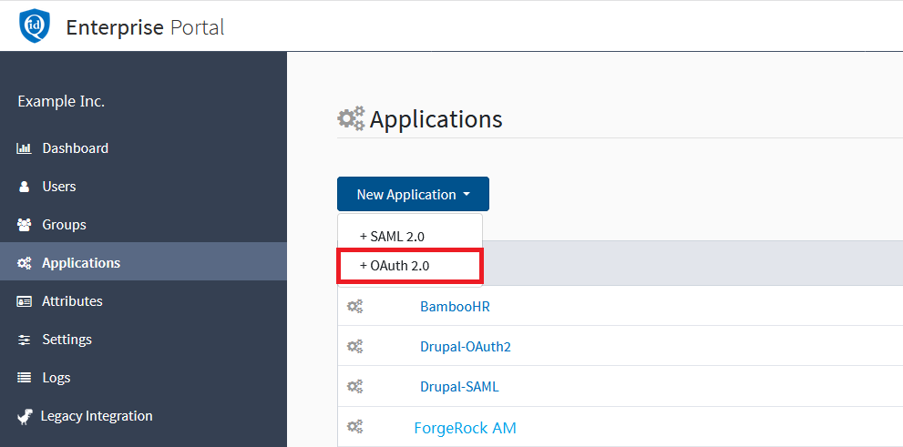
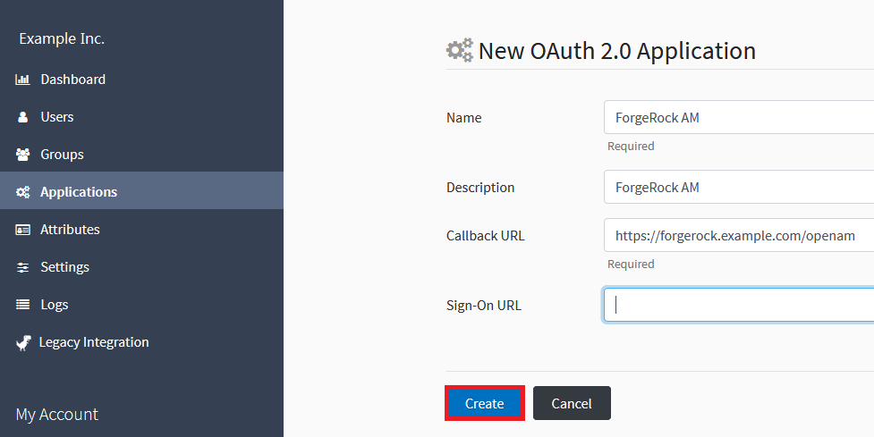
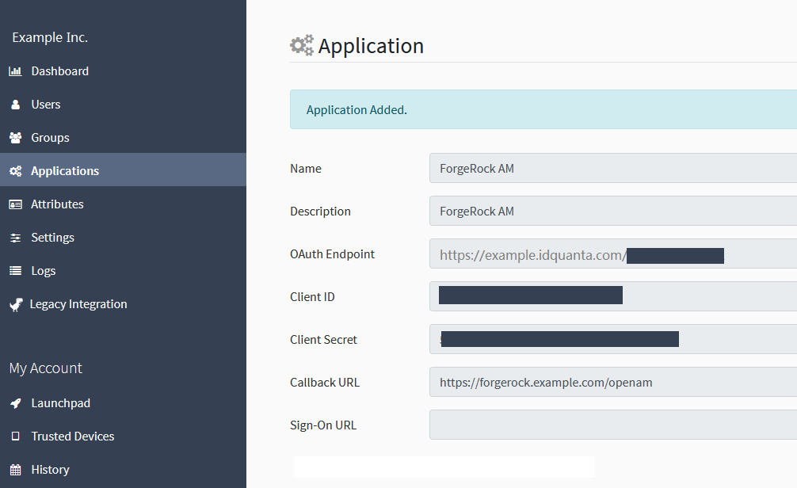
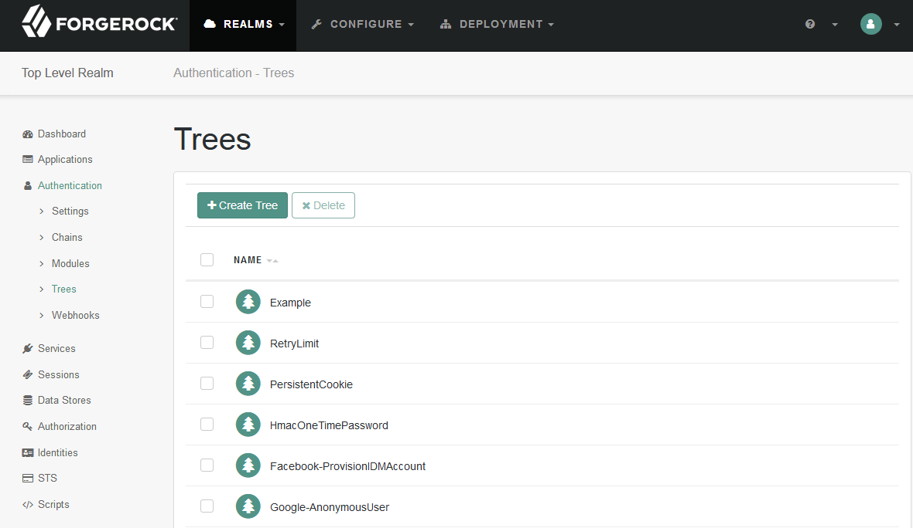
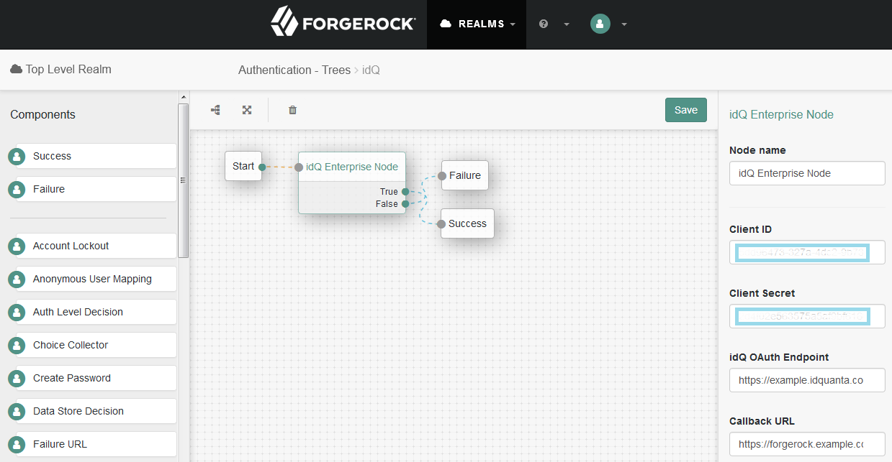
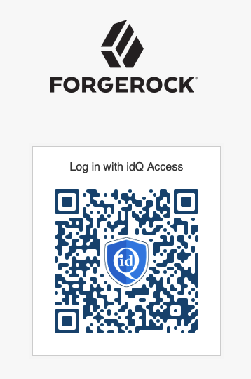

<!--
 * The contents of this file are subject to the terms of the Common Development and
 * Distribution License (the License). You may not use this file except in compliance with the
 * License.
 *
 * You can obtain a copy of the License at legal/CDDLv1.0.txt. See the License for the
 * specific language governing permission and limitations under the License.
 *
 * When distributing Covered Software, include this CDDL Header Notice in each file and include
 * the License file at legal/CDDLv1.0.txt. If applicable, add the following below the CDDL
 * Header, with the fields enclosed by brackets [] replaced by your own identifying
 * information: "Portions copyright [year] [name of copyright owner]".
 *
 * Copyright ${data.get('yyyy')} inBay Technologies Inc. & ForgeRock AS.
-->
 
[www.inbaytech.com](https://www.inbaytech.com/)

# idQ Enterprise Auth Tree Node

This module provides an integration of inBay's [idQ Enterprise](https://www.inbaytech.com/product) with [ForgeRock's Identity Platform](https://www.forgerock.com/platform/).

inBay's idQ Enterprise provides a passwordless authentication solution that's as easy to use as taking a picture with your smartphone. 
Contact [sales@inbaytech.com](mailto:sales@inbaytech.com) to learn more or sign up today.

## __Installation__
Obtain the latest release from https://github.com/inbaytech/forgerock-module/releases

Copy the idqEnterpriseNode.jar file into the __web-container/webapps/openam/WEB-INF/lib__ directory of the ForgeRock AM deployment and restart the web container.  The idQ Enterprise Auth Tree Node will then appear in the authentication trees components palette.

## __Configuring idQ Enterprise__

|   |   |
|---|---|
| 1. Log in to your idQ Enterprise Portal (https://**\<your-organization\>**.idquanta.com) as a user with administrator privilege. 2. Navigate to Applications > New Application > OAuth 2.0 |  |
| 3. On the New OAuth 2.0 Application screen of the idQ Enterprise Portal, enter values for the Name and Callback URL (https://**\<your_ForgeRock_site\>**/openam) fields.  You may optionally supply a Description.  Leave Sign-On URL blank. 4. Click Create. | 
| 5. Upon successful creation, the *Application Added* screen will be shown. 6. Note the OAuth Endpoint, Client ID and Client Secret shown here.  They will be required in the configuration of the ForgeRock AM node. | 

## __Configuring ForgeRock AM__

|   |   |
|---|---|
| 1. Log in to your ForgeRock AM console and create a new Authentication Tree. | 
| 2. Set up the following configuration for the tree that was just created. 3. Enter the Client ID, Client Secret, and the Callback URL from the OAuth application previously configured in your idQ Enterprise Portal. | 

## __Usage__

|   |   |
|---|---|
| 1. Access your newly created authentication tree at https://**\<your-forgerock-site\>**/openam/XUI/#login&service=**\<your-tree-name\>**. 2. To log in, scan the QR code using your idQ Access app. | 
